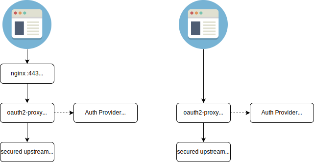

# OAuth2-Proxy

A reverse proxy and static file server that provides authentication using Providers (Google, GitHub, and others) to validate accounts by email, domain or group.

The main functionality of OAuth2-Proxy is to separate user authentication and authorization processes from the application logic. It acts as an intermediary, receiving requests from client applications and interacting with the authentication server using the OAuth 2.0 protocol. It handles authentication flows such as the authorization code flow or implicit flow, obtains access tokens, and then forwards requests to the actual resource server.

Read the docs on our [Docs](https://oauth2-proxy.github.io/oauth2-proxy/) site.
