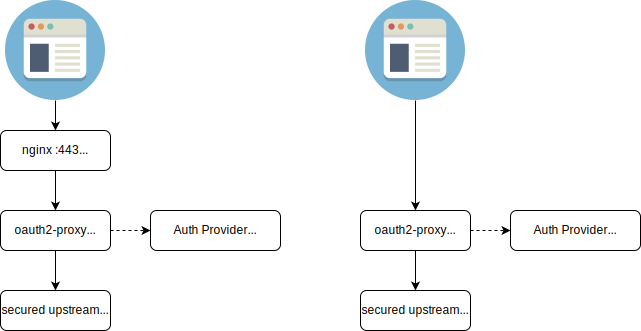

# OAuth2-Proxy

OAuth2-Proxy 是一个反向代理和静态文件服务器，它使用提供商（如 Google、GitHub 等）进行身份验证，通过电子邮件、域名或组来验证账户。

OAuth2-Proxy 的主要功能是将用户身份验证和授权过程与应用程序逻辑进行分离。它充当一个中间层，接收来自客户端应用程序的请求，并使用 OAuth 2.0 协议与认证服务器进行交互。它负责处理 OAuth 2.0的授权代码流（authorization code flow）或隐式流（implicit flow）等认证流程，获取访问令牌（access token），然后将请求转发到实际的资源服务器。

更多文档可参考 [文档网站](https://oauth2-proxy.github.io/oauth2-proxy/)。
